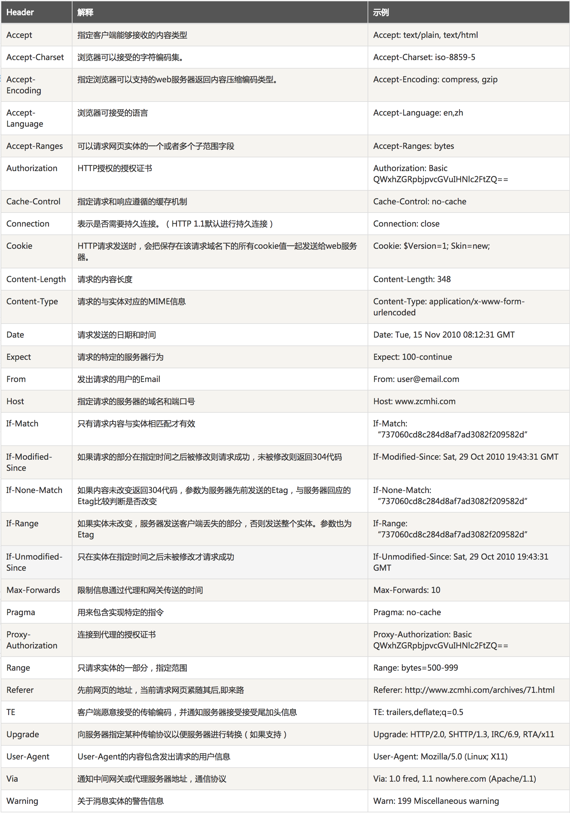

# HTTP

### 什么是HTTP	

**超文本传输协议** **（HTTP，HyperText Transfer Protocol)**，由万维网协会（World Wide Web Consortium）和互联网工程工作小组（Internet Engineering Task Force ）共同合作研究并发布了 RFC 目前标准 HTTP/ 1.1。

客户端和服务器请求和应答时都需要遵循的协议。HTTP 服务默认端口号 80。**当 HTTP 客户端发送请求时，服务器需要响应请求。**响应中包含状态行，如 “HTTP/1.1 200 OK” 和响应的信息，可能还包含错误等。

### 什么是 URI 、URL 和 URN

URI：Uniform Resource Identifier，统一资源标识符。

URL：Uniform Resource Locator，统一资源定位符。

URN：Uniform Resource Name，统一资源名称。

URL，URN 是 URI 的子集，或者说 URI是一种标准， URL 和 URN 是一种实现。

### 请求方法

* OPTIONS：这个方法可使服务器传回该资源所支持的所有HTTP请求方法。用'*'来代替资源名称，向Web服务器发送OPTIONS请求，可以测试服务器功能是否正常运作。

* HEAD：与GET方法一样，都是向服务器发出指定资源的请求。只不过服务器将不传回资源的本文部分。它的好处在于，使用这个方法可以在不必传输全部内容的情况下，就可以获取其中“关于该资源的信息”（元信息或称元数据）。

* GET：向指定的资源发出“显示”请求。使用GET方法应该只用在读取数据，而不应当被用于产生“副作用”的操作中，例如在Web Application中。其中一个原因是GET可能会被网络蜘蛛等随意访问。

* POST：向指定资源提交数据，请求服务器进行处理（例如提交表单或者上传文件）。数据被包含在请求本文中。这个请求可能会创建新的资源或修改现有资源，或二者皆有。

* PUT：向指定资源位置上传其最新内容。

* DELETE：请求服务器删除Request-URI所标识的资源。

* TRACE：回显服务器收到的请求，主要用于测试或诊断。

* CONNECT：HTTP/1.1协议中预留给能够将连接改为管道方式的代理服务器。通常用于SSL加密服务器的链接（经由非加密的HTTP代理服务器）。方法名称是区分大小写的。当某个请求所针对的资源不支持对应的请求方法的时候，服务器应当返回[状态码405](https://zh.wikipedia.org/wiki/HTTP%E7%8A%B6%E6%80%81%E7%A0%81#405)（Method Not Allowed），当服务器不认识或者不支持对应的请求方法的时候，应当返回[状态码501](https://zh.wikipedia.org/wiki/HTTP%E7%8A%B6%E6%80%81%E7%A0%81#501)（Not Implemented）。

* PATCH:用于将局部修改应用到资源。

  ​

  ### 版本信息

  #### 0.9

  已过时。只接受GET一种请求方法，没有在通讯中指定版本号，且不支持请求头。由于该版本不支持POST方法，因此客户端无法向服务器传递太多信息。

  #### HTTP/1.0

  这是第一个在通讯中指定版本号的HTTP协议版本，至今仍被广泛采用，特别是在[代理服务器](https://zh.wikipedia.org/wiki/%E4%BB%A3%E7%90%86%E6%9C%8D%E5%8A%A1%E5%99%A8)中。

  #### HTTP/1.1

  持久连接被默认采用，并能很好地配合代理服务器工作。还支持以[管道方式](https://zh.wikipedia.org/wiki/HTTP%E7%AE%A1%E7%BA%BF%E5%8C%96)在同时发送多个请求，以便降低线路负载，提高传输速度。

  HTTP/1.1相较于HTTP/1.0协议的区别主要体现在：

  - 缓存处理
  - 带宽优化及网络连接的使用
  - 错误通知的管理
  - 消息在网络中的发送
  - 互联网地址的维护
  - 安全性及完整性

  #### HTTP/2

  当前版本，于2015年5月作为互联网标准正式发布。

  ### 状态码

  所有HTTP响应的第一行都是**状态行**，依次是当前HTTP版本号，3位数字组成的[状态代码](https://zh.wikipedia.org/wiki/HTTP%E7%8A%B6%E6%80%81%E7%A0%81)，以及描述状态的短语，彼此由空格分隔。

  例如：HTTP/1.1 200 OK

  - 1xx消息——请求已被服务器接收，继续处理
  - 2xx成功——请求已成功被服务器接收、理解、并接受
  - 3xx重定向——需要后续操作才能完成这一请求
  - 4xx请求错误——请求含有词法错误或者无法被执行
  - 5xx服务器错误——服务器在处理某个正确请求时发生错误

  ### 请求头

  

  ​

  ​

  ### 响应头

  

  ​

  ### 请求体

  一般为请求所需参数，例：

  ~~~
  loginName=180xxxxx&LoginPassword=EAXXFDJKLSJAFLDSAJ
  ~~~

  ​

  ### 响应体

  一般为服务器响应的数据，例：

  ~~~
    ｛"Result": "1",

    "Error": "",

    "ListValues": null,

    "ItemValues": null,

    "SingleValues": "B5826ee19f125a3aa",

    "ConfigValues": null｝

  ~~~

  ​

  ### Request

  由三部分组成，请求行+请求头+请求体

  例：

  ~~~
  GET http://127.0.0.1 HTTP/1.1
  Host:127.0.0.1
  Content-Length:348
  Content-Type:application/x-www-form-unurlencoded

  loginName=180xxxxx&LoginPassword=EAXXFDJKLSJAFLDSAJ
  ~~~

  ### Response

  由三部分组成，状态行+响应头+响应体

  例：

  ~~~
  HTTP/1.1 200 OK
  Content-Type:application/x-www-form-unurlencoded
  Date:Tue,14 Feb 2017 08:01:24 GMT
  Server:Apache
  Content-Length:118
  {
    "Result": "1",
    "Error": "",
    "ListValues": null,
    "ItemValues": null,
    "SingleValues": "B5826ee19f125a3aa",
    "ConfigValues": null
  }
  ~~~

  ### 参考文章

  [百度百科：http](http://baike.baidu.com/link?url=d5Po_8oLLhvzNC02_7ygkCRbkNTU6Y5FmyNTj95QQFBLSwlGekwmiOPtqEOJKszalhzjsA8trhFTCOyFzI1pL_)

  [百度百科：uri](http://baike.baidu.com/item/URI/2901761)

  [RFC](https://tools.ietf.org/html/rfc7230)

  [HTTP_Header](http://tools.jb51.net/table/http_header)

  [维基百科：超文本传输协议]()

  [百度百科：RFC](http://baike.baidu.com/item/RFC/1840)

  ### 相关工具

  [PostMan]()

  Mac终端工具：telnet

  ​

  ​

  ​	

